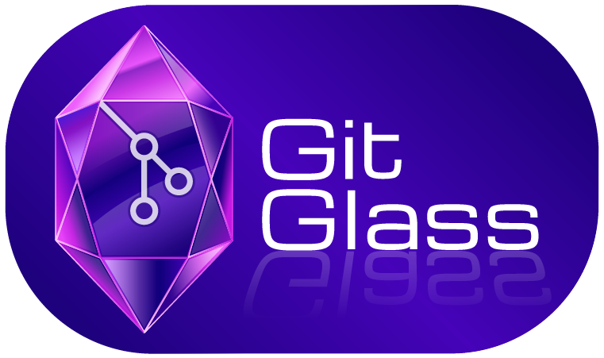

<p align="center">
  
</p>

<h1 align="center">Git Glass</h1>

<p align="center">
  <em>Stable, Seamless Git Syncing for Obsidian</em>
</p>

<p align="center">
  
  
  
</p>

<p align="center">
  Git Glass is a hybrid synchronization engine for Obsidian that bridges Desktop power and Mobile portability.<br>
  <strong>Native Git</strong> on desktop for full speed and reliability · <strong>GitHub API</strong> on mobile for zero-setup · one plugin, every device.
</p>

---

## ✨ Features

| | Feature | Description |
|---|---|---|
| 🔀 | **Hybrid Sync Engine** | Native Git on desktop (fast, full-featured), GitHub REST API on mobile (no dependencies) |
| ⏱️ | **Auto-Sync** | Set a sync interval in minutes and let Git Glass run quietly in the background |
| 🖱️ | **Manual Sync** | One-click sync from the ribbon icon, settings panel, or Command Palette |
| 🛡️ | **Non-Destructive Conflicts** | Timestamped conflict copies ensure neither version is ever lost |
| 🔍 | **Conflict Resolution UI** | Built-in fuzzy search modal to open any conflict pair side by side |
| 🖥️ | **Desktop Flexibility** | Toggle between Native Git (default) or GitHub API on desktop |
| 📦 | **Safe Stash/Pop on Pull** | Local changes are stashed before pulling and reapplied automatically |
| 🚫 | **Smart File Exclusions** | Volatile Obsidian files (workspace, trash, .git) are automatically excluded |
| 📝 | **Automatic `.gitignore`** | Initialize creates or merges a proper `.gitignore` without overwriting existing entries |

---

## 📐 Requirements

| Platform | Requirements |
| :--- | :--- |
| 🖥️ **Desktop (Native Git)** | Git ≥ 2.x installed and accessible via PATH — recommended for best performance. Download: [Windows](https://git-scm.com/download/win) · [macOS](https://git-scm.com/download/mac) · [Linux](https://git-scm.com/download/linux) |
| 🖥️ **Desktop (API mode)** | No Git required — disable **Use Native Git** in settings to use the GitHub API instead |
| 📱 **Mobile** | No additional requirements — always uses GitHub API |
| 🌐 **Both** | A GitHub account, a repository, and a Personal Access Token |

> 💡 **Note:** Git Glass does NOT require Node.js, Python, or any external runtime — it runs entirely inside Obsidian.

---

## 📦 Installation

### Manual Installation

1. Download `main.js` and `manifest.json` from the [latest release](https://github.com/your-repo/git-glass/releases).
2. Navigate to your vault's plugin folder: `.obsidian/plugins/`
3. Create a new folder named `git-glass`.
4. Copy `main.js` and `manifest.json` into that folder.
5. Open Obsidian → **Settings** → **Community Plugins** → enable **Git Glass**.

### Via BRAT (Beta Reviewers Auto-update Tool)

1. Install the [BRAT plugin](https://github.com/TfTHacker/obsidian42-brat) from the Community Plugins list.
2. Open BRAT settings and click **Add Beta Plugin**.
3. Enter the repository URL and follow the prompts.

---

## 🚀 First-Time Setup

### 1. Create a GitHub Repository

1. Log into [GitHub.com](https://github.com).
2. Click **+** (top right) → **New repository**.
3. Give it a name (e.g., `my-obsidian-vault`).
4. Set it to **Private** (recommended for personal notes).
5. Leave all other options at defaults and click **Create repository**.

### 2. Generate a GitHub Token

Git Glass needs a **Personal Access Token (PAT)** with `repo` write permissions.

1. Go to **GitHub.com** → click your avatar → **Settings**.
2. Scroll to the bottom of the left sidebar → **Developer settings**.
3. Click **Personal access tokens** → **Fine-grained tokens**.
4. Click **Generate new token** and fill in:
   - **Token name:** `Git Glass - Obsidian` (or any name you'll recognize)
   - **Expiration:** Choose a duration (1 year is a good default)
   - **Repository access:** Select **Only select repositories** → choose your vault repo
   - **Permissions → Repository permissions → Contents:** Set to **Read and write**
5. Scroll down and click **Generate token**.
6. **Copy the token immediately** — GitHub will never show it again.

> 🔐 **Security tip:** Store your token in a password manager. If it expires or is compromised, revoke it and generate a new one in GitHub settings, then update it in Git Glass.

### 3. Configure the Plugin

Open **Obsidian Settings** → **Git Glass** and fill in:

| Field | What to enter |
| :--- | :--- |
| GitHub Personal Access Token | The token you just generated |
| Repository Owner | Your GitHub username (or org name) |
| Repository Name | The repository name (e.g. `my-obsidian-vault`) |
| Branch | The branch to sync (default: `main`) |

On **Desktop**, also set:

| Field | What to enter |
| :--- | :--- |
| Use Native Git | Leave enabled (recommended) |
| Git Executable Path | `git` (or full path, e.g. `/usr/bin/git`) |
| Remote URL | Your repo's clone URL (e.g. `https://github.com/user/my-obsidian-vault.git`) |

### 4. Initialize Your Repository (Desktop)

> ⚠️ This step is only required **once** on the first desktop device.

1. Open Git Glass settings.
2. Click **Initialize Repository**.
3. Git Glass will:
   - Run `git init` in your vault folder
   - Create or merge a `.gitignore` with Obsidian-specific exclusions
   - Set the `origin` remote to your configured URL
   - Create an initial commit if new files exist

> On subsequent desktop devices, skip this step — just configure the settings and sync. Git Glass will pull the existing repo automatically.

---

## ⚙️ Settings Reference

### 🔑 GitHub Configuration

| Setting | Description |
| :--- | :--- |
| **GitHub Personal Access Token** | Your PAT. Stored locally in Obsidian's plugin data. |
| **Repository Owner** | GitHub username or organization that owns the repo. |
| **Repository Name** | The repository name (not the full URL). |
| **Branch** | Branch to sync with. Defaults to `main`. |

### 🔄 Sync Configuration

| Setting | Description |
| :--- | :--- |
| **Sync Now** | Immediately triggers a pull + push cycle. |
| **Auto Sync** | Toggles automatic background syncing. |
| **Sync Interval** | Minutes between automatic syncs. Minimum recommended: 2 minutes. |

### 🖥️ Desktop Configuration

| Setting | Description |
| :--- | :--- |
| **Use Native Git** | Enabled (default): uses your locally installed `git` binary. Disabled: uses GitHub API (slower, but no git required). |
| **Git Executable Path** | Path to your `git` binary. Usually just `git` if it's in your system PATH. On some systems: `/usr/bin/git` or `C:\Program Files\Git\bin\git.exe`. |
| **Remote URL** | The `https://` clone URL for your repository. Required for Initialize. |
| **Initialize Repository** | Sets up git in your vault folder and connects it to your remote. Run once per machine. |
| **Show Status** | Displays the current git status (commits ahead/behind, changed files). |

---

## 🔄 How to Sync

There are three ways to trigger a sync:

| Method | How |
| :--- | :--- |
| 💎 **Ribbon Icon** | Click the Git Glass icon in the left sidebar |
| ⚙️ **Settings Panel** | Click the **Sync Now** button inside Git Glass settings |
| ⌨️ **Command Palette** | Press `Ctrl/Cmd + P`, type `Git Glass`, select **Sync Now** |

A sync performs a **pull then push**:

1. Pull any remote changes to your local vault.
2. Push your local changes to GitHub.

The **status bar** at the bottom of Obsidian shows the current state:

| Icon | Meaning |
| :---: | :--- |
| `○` | Idle |
| `↻` | Syncing |
| `✓` | Synced |
| `✗` | Error |

---

## 🔬 How It Works

### 🖥️ Desktop — Native Git

On desktop with **Use Native Git** enabled (the default), Git Glass uses your system's `git` binary via the `simple-git` library.

#### Push flow

1. Checks for local changes (excluding vault metadata files).
2. Stages all changed files (`git add .`).
3. Creates a timestamped commit: `Git Glass Sync [2024-01-15T10:30:00.000Z]`.
4. Pulls from origin with `--rebase` to incorporate any remote changes.
5. If a rebase conflict occurs, creates conflict copies and continues the rebase.
6. Pushes the final result to origin.

#### Pull flow

1. Stashes any local uncommitted changes (`git stash push -u`).
2. Pulls from origin.
3. Attempts to pop the stash (`git stash pop`).
4. If a stash-pop conflict occurs, creates conflict copies of affected files.

### 📱 Mobile — GitHub API

On mobile (and on desktop with **Use Native Git** disabled), Git Glass uses the GitHub REST API via Octokit. No local `git` installation needed.

#### API push flow

1. Scans all vault files for changes since the last sync (SHA-1 hash comparison).
2. Creates a Git tree object containing all changed files.
3. Creates a commit pointing to that tree.
4. Updates the branch reference to the new commit.

#### API pull flow

1. Fetches the remote tree for the latest commit.
2. Compares each remote file's SHA against locally tracked hashes.
3. Downloads only changed files.
4. If a local file was modified after the last sync, a conflict copy is created instead of overwriting.

### ⚠️ Conflict Handling

When Git Glass detects that the same file was modified both locally and on the remote, it creates a **conflict copy** rather than overwriting either version.

The conflict copy is named:

```text
your-note (Conflict - 2024-01-15T10-30-00).md
```

- The **original file** keeps the latest remote version.
- The **conflict copy** holds your local version for review.
- A notification appears telling you how many conflicts were detected.

> ✅ No merge markers (`<<<<<<<`) are ever written into your notes.

### 🩹 Resolving Conflicts

After a sync with conflicts:

1. Open the **Command Palette** (`Ctrl/Cmd + P`).
2. Run **Git Glass: Resolve Sync Conflicts**.
3. A fuzzy-search list appears showing all conflict files.
4. Select one to open both versions side by side.
5. Keep the version you want in the original file, then delete the conflict copy.

---

## 🧩 Commands

| Command | Platform | Description |
| :--- | :---: | :--- |
| **Git Glass: Sync Now** | 🖥️ 📱 | Triggers a full pull + push cycle immediately |
| **Git Glass: Initialize Git Repository** | 🖥️ | Sets up git in the vault and connects to remote |
| **Git Glass: Show Git Status** | 🖥️ | Shows commits ahead/behind and changed file count |
| **Git Glass: Resolve Sync Conflicts** | 🖥️ | Opens the conflict resolution modal |

All commands are accessible from the Command Palette (`Ctrl/Cmd + P`).

---

## 🛠️ Troubleshooting

### 🔐 Authentication Errors

#### "Invalid GitHub token" / Sync fails immediately

- Your Personal Access Token may have expired or been revoked.
- Go to [GitHub → Settings → Developer settings → Personal access tokens](https://github.com/settings/tokens) and check its status.
- Generate a new token and update it in Git Glass settings.
- Ensure the token has **Contents: Read and write** permission on the correct repository.

#### "Auth required" error

- The token field is empty. Open Git Glass settings and paste your token.

---

### 📁 Repository Errors

#### "Not a git repository"

- You haven't initialized git in your vault yet.
- Open Git Glass settings and click **Initialize Repository**.

#### "Repository not found"

- Check that **Repository Owner** and **Repository Name** are spelled exactly as they appear on GitHub (case-sensitive).
- Verify the repository exists and your token has access to it.

#### "Remote branch does not exist"

- This is normal on the very first push to an empty repository. Git Glass will push your initial commit and create the branch automatically.

---

### ⚙️ Git Binary Issues (Desktop)

#### "Git executable not found"

- Git is not installed, or it's not in your system PATH.
- **🍎 macOS/Linux:** Run `which git` in a terminal. If nothing appears, install via `brew install git` or your package manager.
- **🪟 Windows:** Download and install [Git for Windows](https://git-scm.com/download/win). The path is typically `C:\Program Files\Git\bin\git.exe`. Enter this full path in **Git Executable Path**.
- After installing git, restart Obsidian.

#### Git is installed but Git Glass can't find it

- Open Git Glass settings and set the full absolute path in **Git Executable Path** (e.g., `/usr/local/bin/git` on macOS, `C:\Program Files\Git\bin\git.exe` on Windows).
- Run **Show Status** to verify git is found.

---

### 🔁 Sync Behavior Issues

#### Changes aren't appearing on the other device

- Confirm both devices are configured to use the same **Branch** (e.g., `main`).
- Check the **Remote URL** setting on desktop — it should point to the correct repository.
- Trigger a manual sync and check for error notifications.

#### Auto-sync stopped working

- Auto-sync is paused if a previous sync is still in progress. Wait for it to complete.
- Disable and re-enable **Auto Sync** in settings to restart the interval.
- Restarting Obsidian also resets the interval.

#### Sync is very slow on mobile

- The GitHub API has rate limits (5,000 requests/hour for authenticated users). If you have a large vault with frequent syncs, you may occasionally hit this limit. Increase your sync interval to reduce API calls.
- Large binary files (images, PDFs, audio) are synced in full on every change. Consider excluding media folders if speed is a concern.

#### "Merge conflict" during push

- This happens when two devices pushed commits to the same branch. Git Glass handles this automatically via `git pull --rebase`. If a rebase conflict can't be resolved automatically, a conflict copy is created and you'll be notified.

---

### 📄 Conflict Copy Issues

#### I see files named "(Conflict - ...)" in my vault

- These are conflict copies created because the same file was edited on two devices between syncs.
- Use the **Resolve Sync Conflicts** command to open them side by side.
- Review the differences, keep the version you want in the original file, then delete the conflict copy.

#### Conflict copies keep appearing for the same file

- This means you're editing the file on multiple devices before syncing. Sync more frequently, or enable **Auto Sync**.

---

### 🔔 Status Bar / UI Issues

#### I don't see the Git Glass ribbon icon

- Try restarting Obsidian.
- Go to **Settings → Community Plugins** → disable and re-enable Git Glass.
- If using Obsidian's icon hiding feature, right-click the ribbon area and check if the icon is hidden.

#### Status bar shows "✗ Sync Error" permanently

- A sync failed. The next auto-sync will attempt again.
- Trigger a manual sync to see the error notification with details.
- Check the Obsidian developer console (`Ctrl/Cmd + Shift + I`) for detailed error output.

---

### 📋 Checking Logs

If you can't determine the cause from notifications:

1. Open the Obsidian developer console: **Ctrl/Cmd + Shift + I** (or `Ctrl/Cmd + Alt + I` on some systems).
2. Switch to the **Console** tab.
3. Filter by `GitGlass` or look for red error entries.
4. Trigger a sync and watch the output.

---

## ❓ FAQ

**Q: Is my data safe if a sync fails mid-way?**
A: Yes. Git Glass never deletes local files. If a push fails, your local changes remain intact and uncommitted. If a pull fails while stashed, Git Glass will attempt to restore your stash. Conflict copies are created before any overwrite.

**Q: Can I use a branch other than `main`?**
A: Yes. Set the **Branch** field in settings to any branch name. Make sure the branch exists on GitHub, or initialize the repository first to create it.

**Q: Does Git Glass sync hidden `.obsidian/` files?**
A: Partially. Plugin data and theme settings are synced (useful for keeping settings consistent). However, volatile files that cause conflicts between devices are excluded: `workspace.json`, `workspace-mobile.json`, and `workspace`. The `.git/` folder and `.trash/` are also excluded.

**Q: What happens if I edit the same note on desktop and mobile before syncing?**
A: Git Glass detects the conflict and creates a timestamped copy (e.g., `note (Conflict - 2024-01-15T10-30-00).md`). Both versions are preserved. Use **Resolve Sync Conflicts** to review and merge them manually.

**Q: Can I use Git Glass with a self-hosted Gitea or GitLab instance?**
A: Not currently. The mobile/API provider is built for the GitHub REST API. Desktop native git works with any remote URL that your system's git can authenticate to, including SSH URLs to self-hosted servers.

**Q: Does Git Glass work with Obsidian Sync?**
A: It's not recommended to run both simultaneously, as they may conflict. Choose one sync solution.

**Q: How do I move my vault to a different GitHub repository?**
A: On desktop, run `git remote set-url origin <new-url>` in your vault folder, then update the Repository Owner, Repository Name, and Remote URL in Git Glass settings. On mobile, just update the settings.

**Q: What file types are synced?**
A: All file types — Markdown, images, PDFs, audio, Canvas files, templates, etc. The only exclusions are Obsidian metadata files (workspace layout) and the `.git/` folder itself.

**Q: Can I have multiple vaults on the same GitHub account?**
A: Yes. Use a separate repository for each vault, and configure each vault's Git Glass settings independently.

**Q: The plugin shows a notice but I missed it — how do I see it again?**
A: Currently there is no notification history. For persistent status, use the **Show Git Status** command or check the Obsidian developer console for logged output.

---

<p align="center">
  Crafted with ♥ by Josh McCann &nbsp;·&nbsp; <a href="LICENSE">MIT License</a>
</p>
